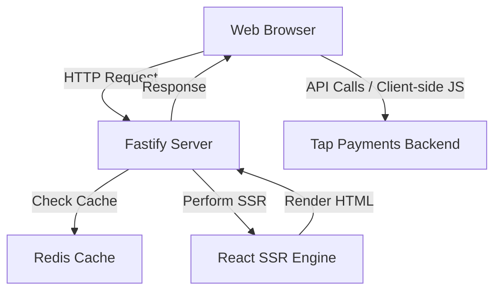

# Architecture

## High-Level Architecture

The project employs a Server-Side Rendering (SSR) approach using Fastify and Vite. The server handles initial requests, performs SSR for the React application, and serves static assets.

## Request Lifecycle

1.  **Request Entry**: A request arrives at the Fastify server (e.g., `/` or `/wrapper`).
2.  **Plugin Processing**: Fastify plugins handle logging, rate limiting, and security headers.
3.  **SSR Execution**: The server uses Vite's SSR capabilities to render the React component tree into a string.
4.  **Hydration**: The rendered HTML is sent to the browser, where React "hydrates" the static content to make it interactive.
5.  **State Management**: Redis is used for caching sessions or frequently accessed configuration data.

## Server-Side Components

- **Fastify Instance**: The core application entry point (`src/server/app.ts`).
- **ErrorHandler Service**: Centralized error logging and Slack notifications.
- **Routes**: Defined in `src/server/routes/`, separating API logic from view logic.
- **Plugins**: Custom and community plugins (JWT, Redis, Helmet, Static).

## Security Architecture

1.  **Helmet**: Configured with strict Content Security Policy (CSP) and frame options.
2.  **Rate Limiting**: Protection against DDoS and brute-force attacks via `fastify-rate-limit`.
3.  **JWT Authentication**: Secure API access where required.
4.  **CORS**: Controlled cross-origin resource sharing.

## Next Steps

- [Folder Structure](./06-folder-structure.md) - Project organization
- [Setup](./02-setup.md) - Installation and scripts
- [Development Guide](./09-development-guide.md) - Adding features
