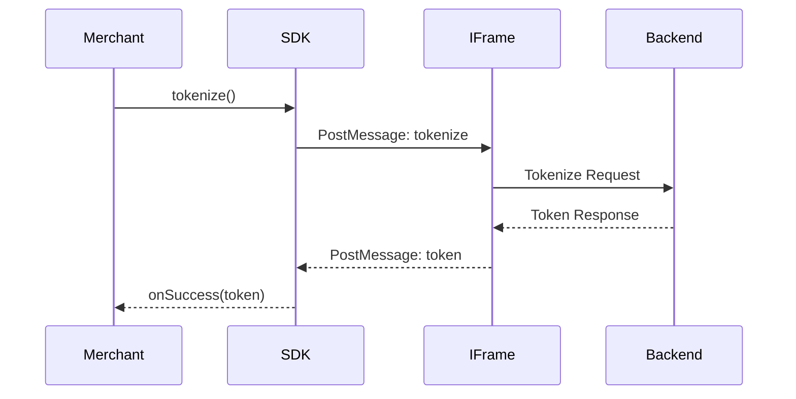
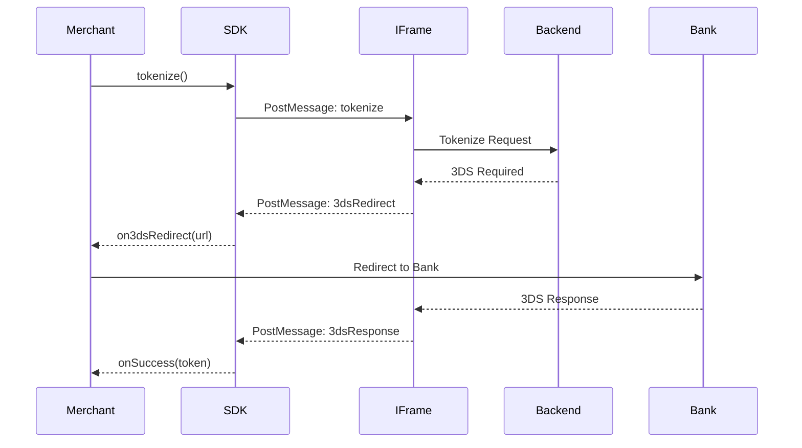
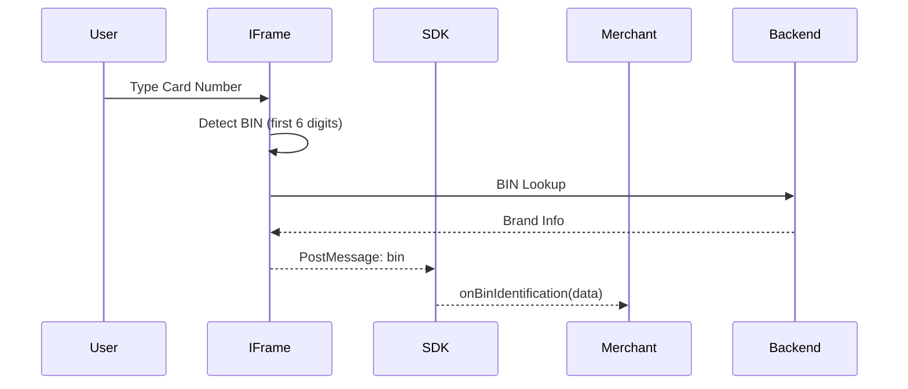

# Events & Communication

## Overview

SDK uses PostMessage API for secure communication between parent page and iframe. All events are typed and follow a consistent pattern.

## PostMessage API

### Parent → IFrame

**Pattern**:
```typescript
iframe.contentWindow.postMessage({
  event: EventType,
  data: EventData
}, frameOrigin)
```

**Example**:
```typescript
const message = {
  event: 'tokenize',
  data: { publicKey: 'pk_test_...' }
}
iframe.contentWindow.postMessage(message, frameOrigin)
```

### IFrame → Parent

**Pattern**:
```typescript
window.parent.postMessage({
  event: EventType,
  data: EventData
}, '*')
```

**Example**:
```typescript
window.parent.postMessage({
  event: 'token',
  data: { token: 'tok_...' }
}, '*')
```

## Event Types

### Parent → IFrame Events

| Event | Purpose | Data |
|-------|---------|------|
| `tokenize` | Trigger tokenization | `{ publicKey }` |
| `saveCard` | Save card | `{ publicKey }` |
| `reset` | Reset form | `{ publicKey }` |
| `updatePaymentOption` | Update config | `{ publicKey, paymentOptions }` |
| `updateThemeMode` | Change theme | `{ publicKey, theme }` |
| `loadSavedCard` | Load saved card | `{ publicKey, cardId }` |
| `hideSavedCardOption` | Show/hide save option | `{ publicKey, hide }` |
| `loadAuthentication` | Load 3DS | `{ publicKey, authenticationUrl }` |
| `cancelAuthentication` | Cancel 3DS | `{ publicKey }` |
| `fillCardInputs` | Fill inputs programmatically | `{ publicKey, cardInputs }` |
| `hideErrorFooter` | Hide error message | `{ publicKey, hide }` |
| `sendIP` | Send IP address | `{ publicKey, ip }` |
| `sendHeaders` | Send headers | `{ publicKey, headers }` |
| `cardMetaData` | Send metadata | `{ publicKey, cardMetaData }` |

### IFrame → Parent Events

| Event | Purpose | Data |
|-------|---------|------|
| `token` | Token created | `{ token, ... }` |
| `authentication` | Authentication created | `{ authentication, ... }` |
| `savedCard` | Card saved | `{ card, ... }` |
| `error` | Error occurred | `{ error, message }` |
| `bin` | BIN identified | `{ bin, brand, ... }` |
| `onCardReady` | Form ready | `{}` |
| `focused` | Input focused | `{ field, focused }` |
| `cardInputs` | Input values changed | `{ valid, ... }` |
| `saveCardForLater` | Save card toggle | `{ enabled }` |
| `saveCardForLaterTap` | Save card tap | `{ enabled }` |
| `resetLoadedCard` | Reset loaded card | `{}` |
| `completeTyping` | Typing complete | `{ complete }` |
| `brand` | Brand detected | `{ brand }` |
| `3dsResponse` | 3DS response | `{ response }` |
| `redirectUrl` | Redirect URL | `{ url }` |
| `on3dsRedirect` | 3DS redirect | `{ url }` |
| `click2Pay` | Click to Pay | `{ data }` |
| `dimension` | Size changed | `{ width, height }` |
| `borderRadius` | Border radius | `{ radius }` |
| `backgroundColor` | Background color | `{ color }` |

## Event Handlers

### Component Props

```typescript
interface CardElementEvents {
  onReady?: () => void
  onFocus?: (flag: boolean) => void
  onBinIdentification?: (data: any) => void
  onValidInput?: (data: any) => void
  onInvalidInput?: (data: any) => void
  onError?: (data: any) => void
  onSuccess?: (data: any) => void
  on3dsRedirect?: (data: any) => void
  on3dsFinish?: () => void
  onCardSaved?: (data: any) => void
  onScannerClick?: () => void
  onNfcClick?: () => void
  // ... more handlers
}
```

### Usage Example

```tsx
<TapCard
  config={config}
  onReady={() => console.log('Card ready')}
  onBinIdentification={(data) => {
    console.log('BIN:', data.bin)
    console.log('Brand:', data.brand)
  }}
  onValidInput={(data) => {
    console.log('All inputs valid')
  }}
  onInvalidInput={(data) => {
    console.log('Some inputs invalid')
  }}
  onSuccess={(data) => {
    console.log('Success:', data.token)
  }}
  onError={(error) => {
    console.error('Error:', error)
  }}
  on3dsRedirect={(data) => {
    console.log('3DS redirect:', data.url)
  }}
  on3dsFinish={() => {
    console.log('3DS completed')
  }}
/>
```

## Event Flow

### Tokenization Flow



### 3DS Flow



### BIN Identification Flow



## Programmatic Functions

### tokenize

```typescript
import { tokenize } from '@tap-payments/card-web'

// Trigger tokenization
tokenize()
```

### saveCard

```typescript
import { saveCard } from '@tap-payments/card-web'

// Save card
saveCard()
```

### resetCardInputs

```typescript
import { resetCardInputs } from '@tap-payments/card-web'

// Reset form
resetCardInputs()
```

### updateCardConfiguration

```typescript
import { updateCardConfiguration } from '@tap-payments/card-web'

// Update configuration
updateCardConfiguration({
  order: {
    amount: 200,
    currency: Currencies.AED
  }
})
```

### updateTheme

```typescript
import { updateTheme } from '@tap-payments/card-web'

// Change theme
updateTheme(Theme.DARK)
```

### loadSavedCard

```typescript
import { loadSavedCard } from '@tap-payments/card-web'

// Load saved card
loadSavedCard('card_123456')
```

## Error Handling

### Error Events

```typescript
onError: (error) => {
  // error structure:
  // {
  //   code: string
  //   message: string
  //   details?: any
  // }
}
```

### Common Errors

| Error Code | Description | Solution |
|------------|-------------|----------|
| `INVALID_PUBLIC_KEY` | Invalid public key | Check key format |
| `NETWORK_ERROR` | Network failure | Check connection |
| `VALIDATION_ERROR` | Input validation failed | Check card data |
| `3DS_ERROR` | 3DS authentication failed | Retry or handle |
| `TOKENIZATION_ERROR` | Tokenization failed | Check configuration |

## Event Listener Setup

### useIFrame Hook

```typescript
const { onMessage, sendMessage } = useIFrame(iframeRef)

// Listen for events
onMessage('token', (data) => {
  console.log('Token:', data.token)
})

onMessage('error', (error) => {
  console.error('Error:', error)
})

// Send events
sendMessage({
  event: 'tokenize',
  data: { publicKey }
})
```

## Best Practices

1. **Always handle errors**: Provide `onError` handler
2. **Validate events**: Check event type and data structure
3. **Debounce events**: For high-frequency events like `bin`
4. **Clean up listeners**: Remove event listeners on unmount
5. **Type safety**: Use TypeScript types for event data

## Next Steps

- [Development Guide](./09-development-guide.md) - Adding features
- [Components](./05-components.md) - Component details
- [Configuration](./07-config.md) - Configuration options
